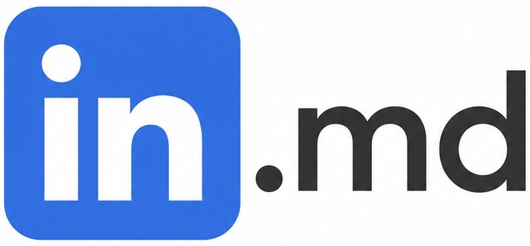

<div align="center">



# LinkedIn → Markdown

**LinkedIn to Markdown, LinkedIn to text, LinkedIn to MD — turn any LinkedIn profile into clean,
LLM-friendly Markdown. Copy it, or download it as a `.md` file.**

A Chrome extension. No account, no server, no tracking — everything happens in your browser.

[](https://github.com/mehradamiri/linkedin-md/actions/workflows/ci.yml)
[](LICENSE)
[](CONTRIBUTING.md)

</div>

---

> [!NOTE]
> **It takes a few seconds.** LinkedIn no longer puts your experience, education or skills on
> the profile page — each section lives on its own page. The extension renders those pages in
> the background, in your tab, and tells you which one it is reading. Leave the tab open.

## Why

**Pasting a LinkedIn profile into Claude or ChatGPT doesn't work.** LinkedIn sits behind a login
wall, so chatbots can't fetch a profile URL themselves — they have no session, so they either
get nothing or a logged-out stub. This extension is a LinkedIn-to-text converter that solves
that: you're already logged in, in your own browser, so it reads the profile there and converts
LinkedIn to Markdown (or plain text) you can paste straight into a chat — for a tailored resume,
a cover letter, interview prep, a candidate summary, whatever the LLM needs the profile for.

Profiles are also worth keeping in plain text for their own sake: your own notes, an Obsidian
vault, a CV you keep in git. Copy-pasting from LinkedIn gives you a mess of duplicated lines and
broken spacing. This gives you Markdown.

## Install

[**Get it from the Chrome Web Store**](https://chromewebstore.google.com/detail/linkedin-to-markdown/oommhmdoldhocnbfggngnihdfdfbmlmd).

Or run it from source:

```bash
git clone https://github.com/mehradamiri/linkedin-md
cd linkedin-md
pnpm install
pnpm build
```

Then open `chrome://extensions`, turn on **Developer mode** (top right), click **Load unpacked**,
and select the `dist/` folder.

Open any LinkedIn profile (`linkedin.com/in/…`) and click the extension icon.

## Privacy

The extension reads the profile you are looking at, in your browser, when you click it.
That's the whole story:

- **Nothing is uploaded.** There is no server, no backend, no third party. The only pages it
  requests are that profile's own LinkedIn section pages (`/details/experience/`, …) — the same
  ones you'd open by clicking "Show all" — loaded inside the tab you're already on.
- **No analytics, no telemetry, no remote code.**
- **No stored data.** The Markdown lives in the popup until you copy or download it.
- **`activeTab` only** — it can only see a tab you explicitly opened it on, and never runs in the
  background. It cannot read your feed, your messages, or any other tab.

Details in [PRIVACY.md](PRIVACY.md).

## Scope

**In scope for v1:** profile pages (`/in/…`) — name, headline, location, about, experience,
education, skills, languages, and licenses & certifications.

**Out of scope:** posts, jobs, company pages, bulk export, and anything that talks to LinkedIn's
private APIs or automates browsing on your behalf. This is a "read the page in front of you"
tool, and stays one.

## Contributing

Contributions welcome — especially selector fixes when LinkedIn redesigns something. Start with
[CONTRIBUTING.md](CONTRIBUTING.md).

```bash
pnpm install
pnpm build      # -> dist/, load unpacked in chrome://extensions
pnpm test       # vitest
pnpm typecheck
pnpm lint
```

Working with Claude Code? [`CLAUDE.md`](CLAUDE.md) has the architecture and conventions, and
[`.claude/skills/linkedin-selectors`](.claude/skills/linkedin-selectors/SKILL.md) is a skill for
writing and repairing the scraping layer.

## Tech

Vite · React · TypeScript · Tailwind v4 · [shadcn/ui](https://ui.shadcn.com) · Manifest V3

## License

[MIT](LICENSE)

---

Not affiliated with, endorsed by, or connected to LinkedIn Corporation.
